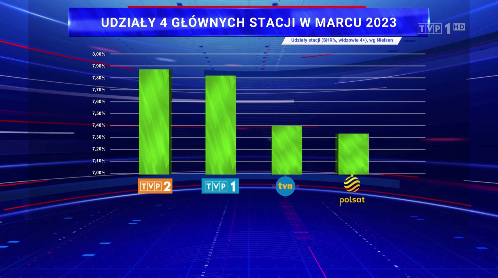

```{r setup, include=FALSE}
knitr::opts_chunk$set(echo = TRUE)
```

# Cel projektu

Zadaniem, jakie przede mną postawiono było znalezienie w środkach masowego przekazu wykresu, który nie jest wykonany zgodnie ze sztuką tworzenia wykresów, a następnie przy użyciu pakietu ggplot2 poprawienie go, tak aby był czytelniejszy, nie fałszował danych i przede wszystkim, był merytorycznie poprawny.

# Zły wykres

  Dnia 14 marca 2023 roku w Wiadomościach na antenie TVP1 wyemitowano materiał o procentowej oglądalności czterech głównych stacji telewizyjnych. Z uwagi na to, że skala na wykresie słupkowym zaczynała się od 7%, niewprawiony widz mógł odnieść wrażenie, jakoby dwie publiczne telewizje posiadały udziały w rynku znacząco wieksze od dwóch najwiekszych konkutentów.
  Jest to doskonały przykład manipulacji skalą, w celu wywołania porządanego wrażenia u odbiorcy. Co więcej, z uwagi na nieco trójwymiarowy kształt oryginalnych słupków nie da sie precyzyjnie odczytać zaprezentowanych wyników.





# Poprawiony wykres

```{r wgranie bibliotek i ramki danych , echo=FALSE, include=FALSE, warning=FALSE, message=FALSE}
options(stringsAsFactors=FALSE)

library(dplyr)
library(ggplot2)
library(forcats)
library(scales)
telewizja <- c("TVP 2", "TVP 1", "TVN", "Polsat")
ogladalnosc <- c("7.85", "7.81", "7.39", "7.32")
ogladalnosc <- as.numeric(ogladalnosc)
Udzialy4Stacji <- data.frame(telewizja, ogladalnosc)
```

  Aby poprawić wykres stworzyłem ramkę danych na podstawie oryginału, następnie użyłem pakietu ggplot2 i dostępnych w nim modyfikacji osi, etykiet, opisów. 


```{r wykres}
wykres <- ggplot(Udzialy4Stacji, aes(x = reorder(telewizja, desc(ogladalnosc)), y = ogladalnosc)) +
  geom_col(width = 0.6, fill = "#40AC61") +
  scale_y_continuous(labels = number_format(suffix = "%"), expand = c(0,0, 0.1, 0.1), n.breaks = 10) +
  theme_minimal() +
  geom_text(aes(label = paste(ogladalnosc, "%", sep = "")), 
            nudge_y = -0.2, 
            colour = "white") +
  expand_limits(y = 9) + 
  labs(x = "",
       y = "",
       title = "UDZIAŁY 4 GŁÓWNYCH STACJI W MARCU 2023", 
       subtitle = "Udziały stacji (SHR%, widzowie 4+), wg Nielsen") +
  theme(plot.title = element_text(hjust = 0.5, face="bold" )) +
  theme(plot.subtitle = element_text(hjust = 1)) +
  theme(axis.text = element_text(face="bold"))
    
```

Efekt finalny prezentuje się następująco:

```{r prezentacja wynikow, echo=FALSE}
print(wykres)
```

  Jak widać porawiony wykres nie pokazuje już tak wyraźnej różnicy między oglądalnością poszczególnych stacji. Dodatkowo, dla lepszej orientacji dodałem podpisy wartości słupków, czego w oryginalnym wykresie nie było.  Niestety, TVP nie odpowiedziała na moją prośbę udostępnienia mi danych użytych w swoim materiale, stąd wartości procentowe zaprezentowane przeze mnie są jedynie oszacowaniem. 

  Uważam, że mój wykres jest lepszy, gdyż nie zakłamuje rzeczywistości tak jak oryginalny. 
