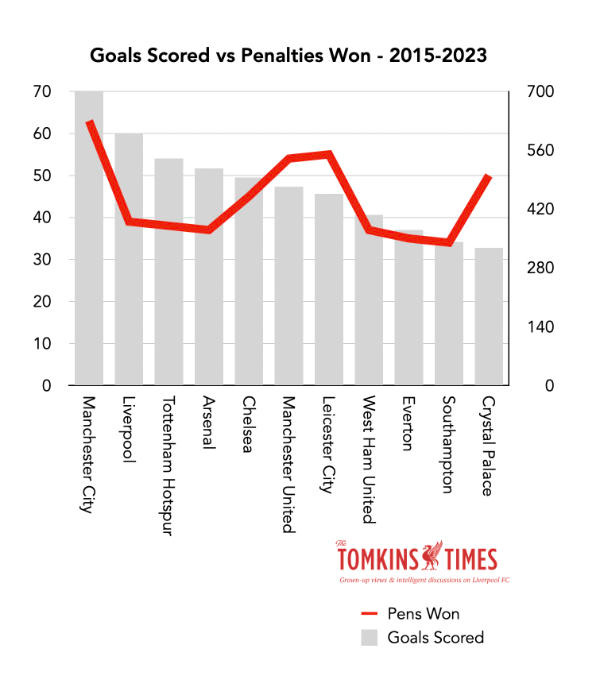

Poprawianą wizualizacją jest wykres znaleziony na kanale poswięconym klubowi sportowemu Liverpool FC w serwisie [Reddit.com](https://www.reddit.com/r/LiverpoolFC/comments/11pix6l/after_winning_our_1st_penalty_of_the_pl_season/).\
Oryginalnym źródłem grafiki jest blog poświęcony analizą danych o zespole  Liverpool [tomkinstimes.substack.com](https://tomkinstimes.substack.com/p/facts-lfc-rank-10th-in-klopp-era)\
Wykres wygląda następująco:

\
Wykres przedstawia liczbę strzelonych bramek oraz liczbę wywalczonych rzutów karnych w latach 2015-2023 dla wybranych 11 zespołów ligi angielskiej.\
Pierwszą wadą takiego przedstawienia danych na wykresie jest brak opisania osi, odbiorca musi sam się domyślić, która oś przedstawia liczbę strzelonych bramek, a która liczbę wywalczonych karnych.\
Domyślamy się, że oś z mniejszą skalą od 0 do 70 to oś liczby rzutów karnych, bo powinno ich być mniej niż strzelonych bramek.
Drugim problemem jest istnienie dwóch skal na osi pionowej.
Czytelnik może pomyśleć, że sytacje w których czerwona linia znajduje się nad lub pod wykresem słupkowym oznacza coś ważnego, a nie oznacza to dosłownie nic.\
Trzecim mankamentem jest umiejscowienie legendy: nie znajduje się ona bezpośrednio obok wykresu, a pod logiem bloga, przez co może ona zostać przeoczona.\
Tak stało się w przypadku osoby, która wkleiła ten wykres na kanał Reddita, ucinając dolną część razem z legendą.

Moim zdaniem, do przedstawienia zależności między dwiema cechami, z których jedna jest zależna od drugiej, lepszy jest wykres punktowy.

```{r, warning=FALSE,message=FALSE,error=FALSE,fig.keep='all'}
library(tidyverse)
library(ggrepel)
df <- read_csv('dane.csv')

ggplot(df, aes(x=Goals_Scored, y=Penalties_Won, color=Club)) + 
  geom_point(size = 2,show.legend = FALSE) + 
  theme(legend.position="none",plot.title = element_text(hjust = 0.5,size=22))+
  geom_text_repel(aes(label = Club), size = 5) +
  labs(title = "Goals Scored vs Penalties Won 2015-2023", x = "Goals Scored", y = "Penalties Won") +
  scale_x_continuous(n.breaks = 10) +
  scale_y_continuous(n.breaks = 10)
```

Uważam, że powyższy wykres jest bardziej czytelny, gdyż łatwiej można zobaczyć na nim relację między liczbą strzelonych bramek i wywalczonych karnych.
Łatwo dostrzec, że Liverpool mimo dużej liczby goli, ma stosunkowo małą liczbę wywalczonych karnych.\
Z kolei drużyną, która wywalczyła dużo rzutów karnych przy dość małej liczbie zdobytych bramek jest Crystal Palace i widać to na pierwszy rzut oka.\
Na oryginalnym wykresie trudno zauważyć, która drużyna jak się pod tym względem wyróżnia.