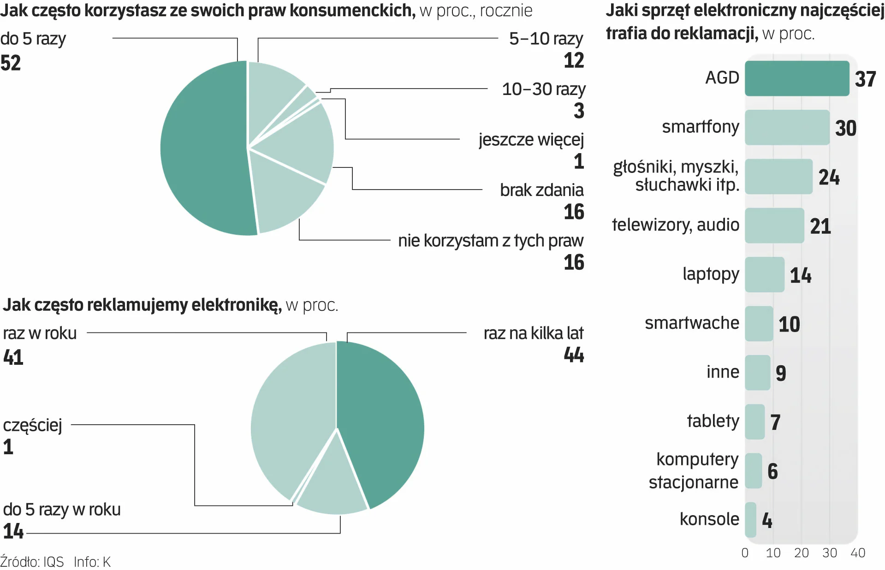
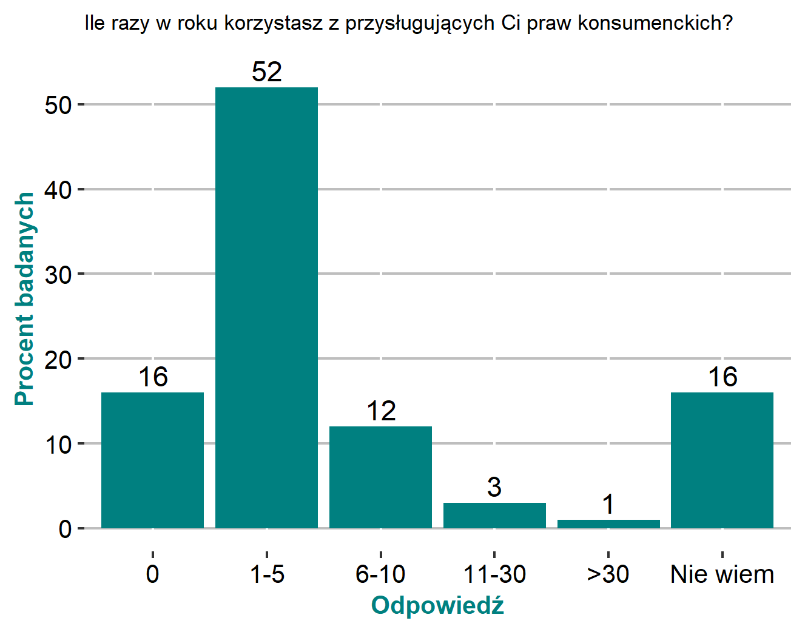
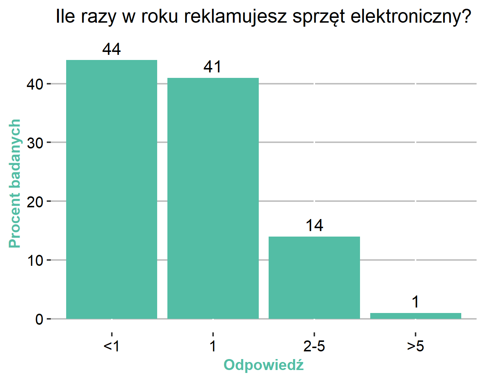

```{r biblioteki, include=FALSE}
library(dplyr)
library(ggplot2)
```

# 1. Oryginalna wizualizacja

Zwyciezcą mojego plebiscytu na najgorszą wizualizację danych z ostatnich 2 tygodni została infografika ilustrująca artykuł w gazecie *"Rzeczpospolita"* zatytułowany *"Polacy lubią reklamacje. Te towary najczęściej zgłaszają"*. Grafika ta składa się z trzech wykresów - dwóch kołowych i jednego słupkowego, z których pierwsze dwa zdecydowanie wymagają poprawy, więc to im poświęciłam pracę domową 2.

Poniżej zamieszczam oryginalną wersję infografiki.




# 2. Poprawiona wizualizacja wraz z kodem

**Wykres 1**



```{r wykres1} 
df <- data.frame(odpowiedź = c("0","1-5", "6-10", "11-30", ">30", "Nie wiem"), 
                 procent.badanych = c(16, 52, 12, 3, 1, 16))
df %>%
  mutate(row = row_number()) %>% 
  ggplot(aes(x = reorder(odpowiedź,row), y = procent.badanych, fill = odpowiedź, 
             label = procent.badanych)) +
  geom_col() +
  geom_text(nudge_y = 2) +
  scale_fill_manual(values = rep(c("#008080"), 6)) +
  theme(legend.position="none",
        title = element_text(size=7),
        axis.title.x = element_text(size=9.75,color='#008080', face = "bold"),
        axis.title.y = element_text(size=9.75,color='#008080', face = "bold"),
        axis.text.x = element_text(size = 10, color='black'),
        axis.text.y = element_text(size = 10, color='black'),
        panel.background = element_blank(),
        panel.grid.major.y = element_line(color = "grey")) +
  ggtitle("Ile razy w roku korzystasz z przysługujących Ci praw konsumenckich?") +
  ylab("Procent badanych") +
  xlab("Odpowiedź") +
  scale_y_continuous(breaks = c(0.0, 10.0, 20.0, 30.0, 40.0, 50.0, 60.0)) -> wykres1
```

**Wykres 2**


```{r wykres 2}
df2 <- data.frame(odpowiedź = c("<1","1", "2-5", ">5"), 
                  procent.badanych = c(44, 41, 14, 1))
df2 %>%
  mutate(row = row_number()) %>% 
  ggplot(aes(x = reorder(odpowiedź,row), y = procent.badanych, fill = odpowiedź, 
             label = procent.badanych)) +
  geom_col() +
  geom_text(nudge_y = 2) +
  scale_fill_manual(values = rep(c("#53BDA5"), 4)) +
  theme(legend.position="none", 
        plot.title = element_text(hjust = 0.5), 
        title = element_text(size=10.5),
        axis.title.x = element_text(size=9.75,color='#53BDA5', face = "bold"),
        axis.title.y = element_text(size=9.75,color='#53BDA5', face = "bold"),
        axis.text.x = element_text(size = 10, color='black'),
        axis.text.y = element_text(size = 10, color='black'),
        panel.background = element_blank(),
        panel.grid.major.y = element_line(color = "grey")) +
  ggtitle("Ile razy w roku reklamujesz sprzęt elektroniczny?") +
  ylab("Procent badanych") +
  xlab("Odpowiedź") +
  scale_y_continuous(breaks = c(0.0, 10.0, 20.0, 30.0, 40.0, 50.0, 60.0)) -> wykres2

```


# 3. Wprowadzone poprawki wraz z uzasadnieniem

Oba wykresy wymagały podobnych poprawek, z tych samych powodów. 

Po pierwsze, ich tytuły oraz nazwy poszczególnych kategorii były niezrozumiałe i nie sugerowały jednoznacznie, jakie dane zostały zaprezentowane na wykresach. Aby zaradzić temu problemowi przeformułowałam zarówno tytuły, zmieniając je na treść zadawanego ankietowanym pytania, jak i potencjalne odpowiedzi respondentów, aby było wiadomo na pewno, co każda z nich oznacza. Sprecyzuję, że wybrałam przy tym najsensowniejszą interpretację zagadnienia, jaka przyszła mi do głowy, choć jej słuszność nie może być potwierdzona w 100%, biorąc pod uwagę ogólną niejasność wykresów. Największą dokonaną zmianą było przemianowanie kategorii "brak zdania" na "nie wiem", jako, że wydaje mi się dość bezsensowne zakładanie, iż ktoś może nie mieć zdania w kwestii rocznej liczby podejmowania przez siebie jakiegoś rodzaju działania. Gdyby do wyboru były odpowiedzi typu "dużo", "mało", to stwarzałoby to może jakieś pole do interpretacji, ale tak?

Po drugie, jasno-zielono-ciemno-zielone wykresy kołowe, z białymi krawędziami i nieproporcjonalnie długimi łamanymi prowadzącymi do nazw poszczególnych kategorii sprawiały, że oba wykresy były bardzo nieczytelne. Z tego względu zdecydowałam się zamienić je na jednokolorowe wykresy słupkowe z podpisanymi osiami i dokładnymi wartościami procentowymi bezpośrednio nad słupkami.
