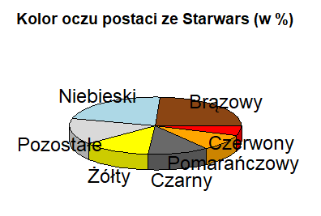
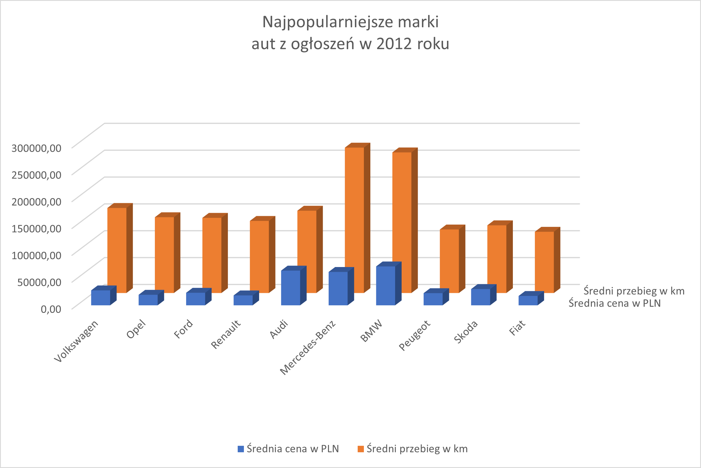
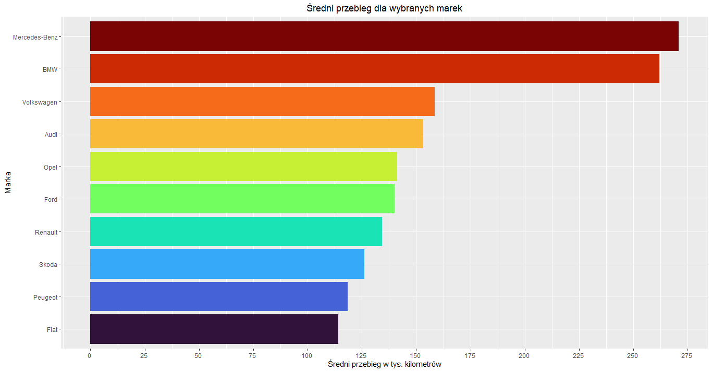

```{r setup, include=FALSE}
knitr::opts_chunk$set(echo = TRUE)
```

```{r include=FALSE}
#Należy zmienić ścieżkę na folder, w którym znajduje się ten plik wraz z wszystkimi plikami graficznymi z wykresami oraz zainstalować pakiet flextable 
library(knitr)
library(dplyr)
library(flextable)
setwd("C:/Users/rober/Documents/RHW3final2")
```
# Wstęp
W raporcie przedstawimy rezultat badania czytelności wykresów przeprowadzonego na próbie 15 osób niezwiązanych na co dzień z zagadnieniami analizy danych.\
Nasze badanie polegało na dwóch eksperymentach, w których sprawdziliśmy, na ile poprawnie nasi ankietowani odczytują dane z różnych form wizualizacji przedstawiajacych dokładnie te same dane.

# Badania

## Eksperyment 1 - Star Wars

W tym eksperymencie utworzyliśmy dwa wykresy przedstawiające procentowy
rozkład występowania różnych kolorów oczu u postaci z serii *Star Wars*
na podstawie ramki danych starwars, która używana była na zajęciach
laboratoryjnych.

Pierwszy wykres to trójwymiarowy wykres kołowy, na którym to nie
zamieściliśmy jednak dokładnych wartości procentowych w formie etykiet.\
Następnie zapytaliśmy ankietowanych, aby odpowiedzieli na dwa pytania:

-   Który kolor oczu występuje najczęściej? (do wyboru brązowy lub
    niebieski)

-   Który kolor występuje częściej: Żółty czy Czarny?

Następnie stworzyliśmy wykres słupkowy przedstawiający te same
dane z podanymi dokładnymi wartościami i etykietami, ale bez kolorów. Stworzona została także jego wersja, w której każdy ze słupków
został pokolorowany na kolor odpowiadający kolorowi oczu, który
reprezentuje, ale bez etykiet.\
Zapytaliśmy uczestników eksperymentu o to:

-   Który wykres jest łatwiejszy w interpretacji?

-   Który wykres jest bardziej estetyczny?

Na sam koniec zadaliśmy pytanie, który z wykresów, trójwymiarowy kołowy
czy prosty słupkowy ze skalą, bez dokładnych wartości, jest ogólnie "lepszy". Poniżej znajduje się tabela z
wynikami naszego badania:

```{r echo=FALSE, results = '|asis'}

ankieta <- read.csv(file = 'ankieta.csv', header=TRUE)
eksperyment1 <- ankieta[,1:6]

flextable(eksperyment1) %>%
  set_header_labels(
    osoba = "Osoba",
    najczestszy_kolor = "Najczęstszy kolor?",
    zolty_czy_czarny = "Żółty czy czarny jest częściej?",
    latwiej_interpretowac = "Który wykres łatwiej interpretować?",
    estetyczny = "Który wykres jest bardziej estetyczny?",
    lepszy = "Który wykres jest lepszy?"
  )%>%
  set_table_properties(layout = "autofit") %>%
  theme_vader() %>%
  set_caption(caption = as_paragraph(as_b('Tabela z wynikami eksperymentu nr 1')))
```

### Sprawdzenie poprawności odczytania danych z wykresu przez badanych


\
```{r echo=FALSE, results = '|asis'}
eksperyment1 %>%
  group_by(najczestszy_kolor) %>%
  summarise(liczba_odpowiedzi=n()) %>%
  flextable() %>%
  set_header_labels(
    najczestszy_kolor = "Odpowiedź",
    liczba_odpowiedzi = "Liczba odpowiedzi"
  )%>%
  set_caption(caption = as_paragraph(as_b("Podsumowanie liczby odpowiedzi na pytanie o najczęstszy kolor oczu")))%>%
  set_table_properties(layout = "autofit") %>%
  theme_vader() %>%
  theme_box()

```

\
Jak widzimy większość osób odpowiedziała poprawnie na pytanie o
odczytanie z wykresu kołowego najczęściej występującego koloru. 3 osoby
odpowiedziały jednakże błędnie wskazując na niebieski kolor jako
częstszy.\

```{r echo=FALSE, results = '|asis'}
eksperyment1 %>%
  group_by(zolty_czy_czarny) %>%
  summarise(liczba_odpowiedzi=n()) %>%
  flextable() %>%
  set_header_labels(
    zolty_czy_czarny = "Odpowiedź",
    liczba_odpowiedzi = "Liczba odpowiedzi"
  )%>%
  set_table_properties(layout = "autofit") %>%
  theme_vader() %>%
  theme_box() %>%
  set_caption(as_paragraph(as_b("Odpowiedzi na pytanie który kolor występuje częściej: Żółty czy czarny?")))
```

\
Na to pytanie również większość ankietowanych udzieliła prawidłowej
odpowiedzi, że żólty występuje częściej niż czarny.\
Znalazły się jednak 3 osoby, które błędnie odczytały dane z wykresu
wskazując na kolor czarny jako częstszy.

### Subiektywne opinie na temat wykresów

```{r echo=FALSE, fig.show='hold', fig.cap="Wykres 1 (po lewej) oraz Wykres 2 (po prawej)"}
knitr::include_graphics(c('HW3-bar_no_colors_pl.png','HW3-bar_no_labels_pl.png'))
```

```{r echo=FALSE}
eksperyment1 %>%
  group_by(latwiej_interpretowac) %>%
  summarise(liczba_odpowiedzi=n()) %>%
  flextable()%>%
  set_header_labels(
    latwiej_interpretowac = "Odpowiedź",
    liczba_odpowiedzi = "Liczba odpowiedzi"
  )%>%
  set_caption(as_paragraph(as_b("Odpowiedzi na pytanie który wykres łatwiej interpretować"))) %>%
  set_table_properties(layout = "autofit") %>%
  theme_vader() %>%
  theme_box()
```

\
Wśrod naszych respondentów zdania są podzielone co do tego, czy wykres słupkowy czarno-biały z etykietami tekstowymi z nazwą koloru czy ten sam wykres, ale z kolorowymi słupkami jest łatwiejszy w interpretacji.\

```{r echo=FALSE}
eksperyment1 %>%
  group_by(estetyczny) %>%
  summarise(liczba_odpowiedzi=n()) %>%
  flextable() %>%
  set_header_labels(
    estetyczny = "Odpowiedź",
    liczba_odpowiedzi = "Liczba odpowiedzi"
  )%>%
  set_caption(as_paragraph(as_b("Odpowiedzi na pytanie który wykres jest bardziej estetyczny"))) %>%
  set_table_properties(layout = "autofit") %>%
  theme_vader() %>%
  theme_box()
```

\
Jeśli chodzi o to, który jest bardziej estetyczny, to wykres z pokolorowanymi słupkami cieszy się większym uznaniem.
\

```{r echo=FALSE, fig.show='hold', fig.cap="Wykres 1 (po lewej) oraz Wykres 2 (po prawej)"}
knitr::include_graphics(c('HW3-pie_pl.png','HW3-bar_niedokladny_pl.png'))
```

```{r echo=FALSE}
eksperyment1 %>%
  group_by(lepszy) %>%
  summarise(liczba_odpowiedzi=n()) %>%
  flextable() %>%
  set_header_labels(
    lepszy = "Odpowiedź",
    liczba_odpowiedzi = "Liczba odpowiedzi"
  )%>%
  set_caption(as_paragraph(as_b("Odpowiedzi na pytanie który wykres jest lepszy")))%>%
  set_table_properties(layout = "autofit") %>%
  theme_vader() %>%
  theme_box()
```

\
Wszyscy badani jednoznacznie wskazali, że wykres słupkowy ze skalą jest
zdecydowanie lepszą formą przedstawienia danych niż wykres kołowy 3D.

## Eksperyment 2 - Auta

W tym eksperymencie stworzone zostały dwie wizualizacje przedstawiające
te same dane na temat samochodów z ramki danych auta2012 z pakietu
*PogromcyDanych*.\
Wykresy przedstawiają średnią cenę aut oraz ich średni przebieg dla 10
najpopularniejszych marek.\
Pierwsza wizualizacja została utworzona w programie *Microsoft Excel* i
ma ona formę wykresu trójwymiarowego, gdzie pierwszy rząd słupków danych
przedstawia średnią cenę, a drugi rząd znajdujący się za nim - średni
przebieg. Zarówno wartości liczbowe ceny jak i przebiegu są pokazane na
tej samej osi liczbowej.\
Drugi sposób przedstawienia danych został utworzony za pomocą pakietu
*ggplot* i składa się z dwóch wykresów słupkowych. Pierwszy z nich
przedstawia średnią cenę auta, a drugi średni przebieg dla danej marki.\

Uczestnikom eksperymentu zadaliśmy trzy pytania:

-   Czy średnia cena Audi jest większa czy mniejsza niż 50000?

    *(Poprawna odpowiedź: większa)*

-   Dla ilu marek samochodów średni przebieg w km przekracza 150 tys. km?
    (Proszę podać liczbę)

    *(Poprawna odpowiedź: 4)*
-   Czy wykresy słupkowe trójwymiarowe wprowadzają odbiorcę w błąd?
\
```{r echo=FALSE, results = '|asis'}

eksperyment2 <- ankieta[,c(1,7:11)]
flextable(eksperyment2) %>%
  set_header_labels(
    osoba = "Osoba",
    cena_audi_wieksza_1 = "Czy cena Audi jest większa niż 50 tys. na wykresie 1?",
    przebieg_przekracza_1 = "Liczba marek dla których przebieg > 150 000 km na wykresie 1?",
    cena_audi_wieksza_2 = "Czy cena Audi jest większa niż 50 tys. na wykresie 2?",
    przebieg_przekracza_2 = "Liczba marek dla których przebieg > 150 000 km na wykresie 2?",
    czy_3d_wprowadza_w_blad = "Czy wykresy 3D wprowadzają w błąd?"
  )%>%
  set_table_properties(layout = "autofit") %>%
  #align_nottext_col(align = "right")%>%
  theme_vader() %>%
  set_caption(caption = as_paragraph(as_b("Tabela z wynikami eksperymentu nr 2")))
```

### Pierwsza wizualizacja i poprawność odpowiedzi na jej podstawie

\


\

```{r echo=FALSE, results = '|asis'}
eksperyment2 %>%
  group_by(cena_audi_wieksza_1) %>%
  summarise(liczba_odpowiedzi=n()) %>%
  flextable() %>%
  set_header_labels(
    cena_audi_wieksza_1 = "Odpowiedź",
    liczba_odpowiedzi = "Liczba odpowiedzi"
  )%>%
  set_caption(as_paragraph(as_b("Podsumowanie liczby odpowiedzi na pytanie czy cena Audi jest większa niż 50 000 PLN")))%>%
  set_table_properties(layout = "autofit") %>%
  theme_vader() %>%
  theme_box()

```
\
Wszyscy badani źle odczytali dane i odpowiedzieli, że średnia cena Audi jest mniejsza niż 50 000 PLN. 
\
```{r echo=FALSE, results = '|asis'}
eksperyment2 %>%
  group_by(przebieg_przekracza_1) %>%
  summarise(liczba_odpowiedzi=n()) %>%
  flextable() %>%
  set_header_labels(
    przebieg_przekracza_1 = "Odpowiedź",
    liczba_odpowiedzi = "Liczba odpowiedzi"
  )%>%
  set_caption(caption = as_paragraph(as_b("Podsumowanie liczby odpowiedzi na pytanie dla ilu marek samochodów średni przebieg w km przekracza 150 tys.")))%>%
  set_table_properties(layout = "autofit") %>%
  theme_vader() %>%
  theme_box()

```
\
Na to pytanie również nikt nie wskazał poprawnej odpowiedzi, jaką jest liczba 4.


### Druga wizualizacja i poprawność odpowiedzi na jej podstawie



\
```{r echo=FALSE, results = '|asis'}
eksperyment2 %>%
  group_by(cena_audi_wieksza_2) %>%
  summarise(liczba_odpowiedzi=n()) %>%
  flextable() %>%
  set_header_labels(
    cena_audi_wieksza_2 = "Odpowiedź",
    liczba_odpowiedzi = "Liczba odpowiedzi"
  )%>%
  set_caption(caption = as_paragraph(as_b("Podsumowanie liczby odpowiedzi na pytanie czy cena Audi jest większa niż 50 000 PLN")))%>%
  set_table_properties(layout = "autofit") %>%
  theme_vader() %>%
  theme_box()

```
\
Tym razem każdy poprawnie odczytał dane dotyczące ceny Audi.
\
```{r echo=FALSE, results = '|asis'}
eksperyment2 %>%
  group_by(przebieg_przekracza_2) %>%
  summarise(liczba_odpowiedzi=n()) %>%
  flextable() %>%
  set_header_labels(
    przebieg_przekracza_2 = "Odpowiedź",
    liczba_odpowiedzi = "Liczba odpowiedzi"
  )%>%
  set_caption(caption = as_paragraph(as_b("Podsumowanie liczby odpowiedzi na pytanie dla ilu marek samochodów średni przebieg w km przekracza 150 tys.")))%>%
  set_table_properties(layout = "autofit") %>%
  theme_vader() %>%
  theme_box()

```
\
Również pytanie dotyczące liczby marek, dla których średni przebieg przekracza 150 000 km nie przysporzyło kłopotów badanych i wszyscy odpowiedzieli prawidłowo.
\


### Czy wykresy słupkowe trójwymiarowe wprowadzają odbiorcę w błąd?
```{r echo=FALSE, results = '|asis'}
eksperyment2 %>%
  group_by(czy_3d_wprowadza_w_blad) %>%
  summarise(liczba_odpowiedzi=n()) %>%
  flextable() %>%
   set_header_labels(
    czy_3d_wprowadza_w_blad = "Odpowiedź",
    liczba_odpowiedzi = "Liczba odpowiedzi"
  )%>%
  set_caption(caption = as_paragraph(as_b("Podsumowanie liczby odpowiedzi na pytanie czy wykresy słupkowe trójwymiarowe wprowadzają odbiorcę w błąd")))%>%
  set_table_properties(layout = "autofit") %>%
  theme_vader() %>%
  theme_box()

```
\
Na to pytanie wyraźna większość ankietowanych odpowiedziała twierdząco.
\

# Wnioski
Biorąc pod uwagę rezultaty powyższych badań możemy stwierdzić, że aby przedstawić dane w sposób zrozumiały i nie budzący wątpliwości dla odbiorcy, należy unikać wykresów kołowych oraz wykresów trójwymiarowych. 
\
Niezawodną formą przedstawiania danych okazują się proste wykresy słupkowe i kolumnowe.