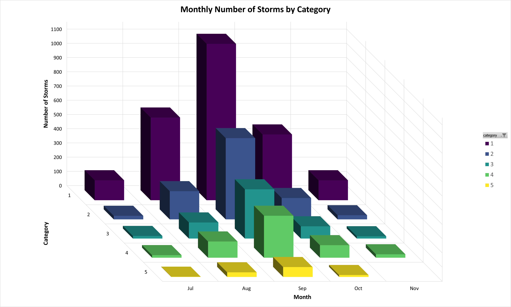

<style type="text/css">
  .main-container {
    max-width: 1920px;
    margin: auto;
  }
  
  body {
    font-family: Helvetica;
    font-size: 14pt;
  }
</style>

```{r setup, include=FALSE}
knitr::opts_chunk$set(echo = TRUE)
```

```{r libraries, include=FALSE, message=FALSE, warning=FALSE}
library(dplyr)
library(ggplot2)
```

## Wstęp

Celem pracy domowej jest sprawdzenie czy "dobre praktyki" opracowane lata temu (słupki lepsze niż kąty, kolor wykorzystywany z umiarem, unikanie ozdobników), faktycznie działają w społeczeństwie które wykresami karmione jest od urodzenia. W tym celu należało wśród przynajmniej 15 osób przeprowadzić eksperyment sprawdzający czy określone problemy z czytaniem danych wciąż występują. 

## Opis eksperymentu

W ramach eksperymentu sporządzono dwa wykresy w oparciu o dane pochodzące z obecnej w bibliotece *dplyr* ramki danych *storms*, zawierającej dane dotyczące huraganów i zbierane w latach 1975-2021 przez *National Oceanic and Atmospheric Administration* (NOAA). Wykresy przedstawiały łączną liczbę huraganów z lat 1975-2021 ze względu na miesiąc &ndash; od lipca do listopada &ndash; i kategorię burzy w skali Saffira-Simpsona od 1 do 5. 

Pierwsza wizualizacja została wykonana w formie wykresu słupkowego 3D, gdzie głębia wykresu oznaczała kategorię huraganu. 

```{r storms_3d, echo=FALSE, out.width='75%', fig.align='center'}

```

Druga wizualizacja była wykresem słupkowym 2D, gdzie kategorię oznaczały sąsiadujące słupki w kolorach przyjętych dla poszczególnych kategorii.

```{r storms_2d, fig.dim=c(16, 9), fig.align='center', out.width='75%'}
storms <- storms |> 
  filter(!is.na(category), between(month, 7, 11)) |> 
  mutate(
    month = factor(month, levels = 1:12, labels = month.abb), 
    category = factor(category, levels = 1:5)
  )

storms |> 
  ggplot(aes(x = month)) +
  geom_bar(
    aes(fill = category), 
    position = position_dodge(preserve = "single")
  ) +
  scale_y_continuous(n.breaks = 10) +
  scale_fill_viridis_d() +
  labs(
    title = "Monthly Number of Storms by Category",
    x = "Month",
    y = "Number of Storms",
    fill = "Category"
  ) +
  theme_minimal() +
  theme(
    plot.title = element_text(size = 20, face = "bold",  hjust = 0.5),
    axis.title = element_text(size = 14, color = "black", face = "bold"),
    axis.title.x = element_text(margin = margin(t = 10)),
    axis.title.y = element_text(margin = margin(r = 20)),
    axis.text = element_text(size = 12, color = "black"),
    legend.title = element_text(size = 14, face = "bold", color = "black"),
    legend.text = element_text(size = 12, color = "black"),
    legend.key.size = unit(1, "cm")
  )
```

Następnie wśród 20 dowolnie wybranych i niezwiązanych z analityką danych osób przeprowadzono ankietę, na którą składały się trzy poniższe pytania:

1. Których burz w październiku (Oct) było więcej &ndash; 3. czy 4. kategorii? [Odp.: 4.]
2. Odszukaj na wykresie miesiąc i kategorię burzy, która wystąpiła dokładnie 346 razy [Odp.: Wrzesień (Sep), kategoria 3.]
3. Z którym typem wykresów spotykasz się częściej &ndash; 2D czy 3D?

Pierwsze dwa pytania dotyczyły odczytywania informacji z wykresów i były zadawane dwukrotnie, raz dla wykresu 2D, i drugi raz dla wykresu 3D. Trzecie pytanie zostało zadane raz na koniec ankiety.

## Wyniki eksperymentu

Dokładne wyniki eksperymentu przedstawia tabela poniżej:

```{r results}
results <- tibble(
  id = 1:20,
  p3dq1 = c(3, 3, 3, 3, 4, 3, 4, 3, 4, 3, 4, 3, 3, 4, 3, 3, 3, 4, 3, 4),
  p3dq2 = c("Wrzesień (Sep), kategoria 3.", "Wrzesień (Sep), kategoria 4.", 
                "Sierpień (Aug), kategoria 2.", "Wrzesień (Sep), kategoria 4.", 
                "Wrzesień (Sep), kategoria 3.", "Wrzesień (Sep), kategoria 4.", 
                "Sierpień (Aug), kategoria 2.", "Wrzesień (Sep), kategoria 4.", 
                "Wrzesień (Sep), kategoria 4.", "Wrzesień (Sep), kategoria 4.", 
                "Wrzesień (Sep), kategoria 4.", "Wrzesień (Sep), kategoria 4.", 
                "Wrzesień (Sep), kategoria 4.", "Wrzesień (Sep), kategoria 3.", 
                "Wrzesień (Sep), kategoria 3.", "Wrzesień (Sep), kategoria 3.", 
                "Wrzesień (Sep), kategoria 4.", "Wrzesień (Sep), kategoria 4.", 
                "Październik (Oct), kategoria 2.", 
                "Wrzesień (Sep), kategoria 4."),
  p2dq1 = c(4, 4, 3, 4, 4, 4, 4, 4, 4, 3, 4, 4, 4, 4, 3, 4, 4, 4, 4, 4),
  p2dq2 = c("Wrzesień (Sep), kategoria 3.", "Wrzesień (Sep), kategoria 3.", 
                "Wrzesień (Sep), kategoria 4.", "Wrzesień (Sep), kategoria 3.", 
                "Wrzesień (Sep), kategoria 3.", "Wrzesień (Sep), kategoria 3.", 
                "Wrzesień (Sep), kategoria 3.", "Wrzesień (Sep), kategoria 3.", 
                "Wrzesień (Sep), kategoria 3.", "Wrzesień (Sep), kategoria 3.", 
                "Wrzesień (Sep), kategoria 3.", "Wrzesień (Sep), kategoria 3.", 
                "Wrzesień (Sep), kategoria 3.", "Wrzesień (Sep), kategoria 3.", 
                "Wrzesień (Sep), kategoria 3.", "Wrzesień (Sep), kategoria 3.", 
                "Wrzesień (Sep), kategoria 3.", "Wrzesień (Sep), kategoria 3.", 
                "Wrzesień (Sep), kategoria 3.", 
                "Wrzesień (Sep), kategoria 3."),
  q3 = c("2D", "2D", "2D", "2D", "2D", "2D", "3D", "2D", "2D", "2D", "2D",
         "2D", "3D", "2D", "2D", "2D", "2D", "2D", "2D", "2D")
) |> mutate(across(-id, ~ as.factor(.)))

colnames <- c("Nr osoby", "Wykres 3D - pytanie 1.", "Wykres 3D - pytanie 2.",
              "Wykres 2D - pytanie 1.", "Wykres 2D - pytanie 2.", "Pytanie 3")
knitr::kable(results, col.names = colnames, align = 'c')
```

### Wyniki pierwszego pytania

Pierwsze pytanie dotyczyło porównywania wielkości na wykresach. Odpowiedzi na to pytanie dla pierwszego jak i drugiego wykresu wyglądają następująco:  

```{r answers1, fig.dim=c(16, 9), fig.align='center', out.width='75%'}
results1 <- results |> 
  tidyr::pivot_longer(
    c(p3dq1, p2dq1),  
    names_to = "question1", 
    values_to = "response1"
  ) |> 
  mutate(question1 = factor(question1, c("p3dq1", "p2dq1")))

results1 |> ggplot(aes(x = question1)) +
  geom_bar(aes(fill = response1), position = "dodge") +
  scale_x_discrete(
    labels = c(
      "p3dq1" = "Wykres 3D",
      "p2dq1" = "Wykres 2D"
    )
  ) +
  scale_y_continuous(n.breaks = 10) +
  scale_fill_manual(values = c("#a70000", "#006000")) +
  labs(
    title = "Uzyskane odpowiedzi na pytanie pierwsze",
    x = "Typ wykresu",
    y = "Liczba odpowiedzi",
    fill = "Odpowiedź"
  ) +
  theme_minimal() +
  theme(
    plot.title = element_text(size = 20, face = "bold",  hjust = 0.5),
    axis.title = element_text(size = 14, color = "black", face = "bold"),
    axis.title.x = element_text(margin = margin(t = 10)),
    axis.title.y = element_text(margin = margin(r = 20)),
    axis.text = element_text(size = 12, color = "black"),
    legend.title = element_text(size = 14, face = "bold", color = "black"),
    legend.text = element_text(size = 12, color = "black"),
    legend.key.size = unit(1, "cm")
  )
```

Z porównania wyników uzyskanych dla odpowiednich wykresów wyraźnie wynika, że zdecydowanie większa liczba ankietowanych nie miała problemu z udzieleniem prawidłowej odpowiedzi przy wykresie 2D. Tylko 3 osoby udzieliły błędnej odpowiedzi w przypadku tego wykresu, natomiast aż 13 osób udzieliło odpowiedzi błędnej w przypadku wykresu 3D.

### Wyniki drugiego pytania

Drugie pytanie dotyczyło znajdywania konkretnych obiektów o wskazanych parametrach na wykresach. Odpowiedzi na to pytanie dla pierwszego jak i drugiego wykresu wyglądają następująco:

```{r answers2, fig.dim=c(16, 9), fig.align='center', out.width='75%'}
results2 <- results |> 
  tidyr::pivot_longer(
    c(p3dq2, p2dq2),  
    names_to = "question2", 
    values_to = "response2"
  ) |> 
  mutate(question2 = factor(question2, c("p3dq2", "p2dq2")))

results2 |> ggplot(aes(x = question2)) +
  geom_bar(aes(fill = response2), position = "dodge") +
  scale_x_discrete(
    labels = c(
      "p3dq2" = "Wykres 3D",
      "p2dq2" = "Wykres 2D"
    )
  ) +
  scale_y_continuous(n.breaks = 10) +
  scale_fill_manual(values = c("#a70000", "#ff5252", "#006000", "#ffbaba")) +
  labs(
    title = "Uzyskane odpowiedzi na pytanie drugie",
    x = "Typ wykresu",
    y = "Liczba odpowiedzi",
    fill = "Odpowiedź"
  ) +
  theme_minimal() +
  theme(
    plot.title = element_text(size = 20, face = "bold",  hjust = 0.5),
    axis.title = element_text(size = 14, color = "black", face = "bold"),
    axis.title.x = element_text(margin = margin(t = 10)),
    axis.title.y = element_text(margin = margin(r = 20)),
    axis.text = element_text(size = 12, color = "black"),
    legend.title = element_text(size = 14, face = "bold", color = "black"),
    legend.text = element_text(size = 12, color = "black"),
    legend.key.size = unit(1, "cm")
  )
```
Analiza odpowiedzi na drugie pytanie wskazuje na duże trudności w odczytywaniu wykresów 3D. Tylko 5 osób spośród 20 ankietowanych udzieliło poprawnej odpowiedzi. Należy podkreślić, że z udzieleniem prawidłowej odpowiedzi nie mieli ankietowani w przypadku wykresu 2D. Tylko jedna osoba udzieliła nieprawidłowej odpowiedzi, przy czym takiej samej błędnej odpowiedzi w przypadku wykresu 3D udzieliło aż 12 ankietowanych. 

### Wyniki trzeciego pytania

Trzecie pytanie dotyczyło doświadczeń ankietowanych z poszczególnymi typami wykresów. Odpowiedzi na to pytanie wyglądają następująco:

```{r answers3}
results |> 
  select(q3) |> 
  table() |> 
  knitr::kable(
    caption = "Uzyskane odpowiedzi na trzecie pytanie", 
    col.names = c("Odpowiedź", "Liczba odpowiedzi"),
    align = "l"
  )
```

Odpowiedzi ankietowanych jednoznacznie wskazują, że wykresy 2D są szeroko stosowane i rozpowszechnione. Tylko 2 ankietowanych wskazało, że częściej miało do czynienia z wykresami 3D.

## Podsumowanie

Wyniki ankiety dowodzą, że wykresy sporządzone w formie 2D są wyraźnie czytelniejsze i bardziej zrozumiałe dla społeczeństwa niż odpowiadające im wykresy 3D. Odczytywanie danych z wykresów 2D nie stwarza dla czytających je osób większych trudności. Ankieta potwierdziła, że "dobre praktyki" opracowane lata temu faktycznie działają w społeczeństwie.
