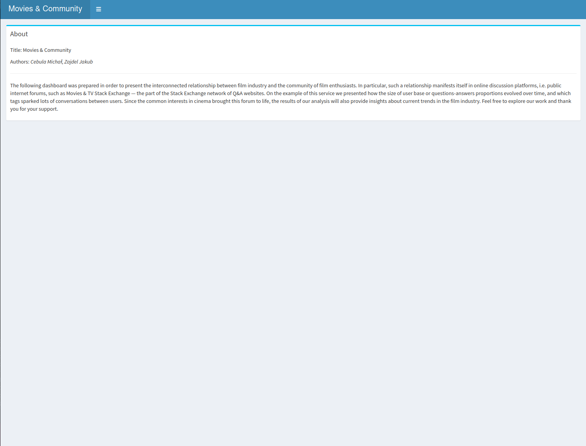
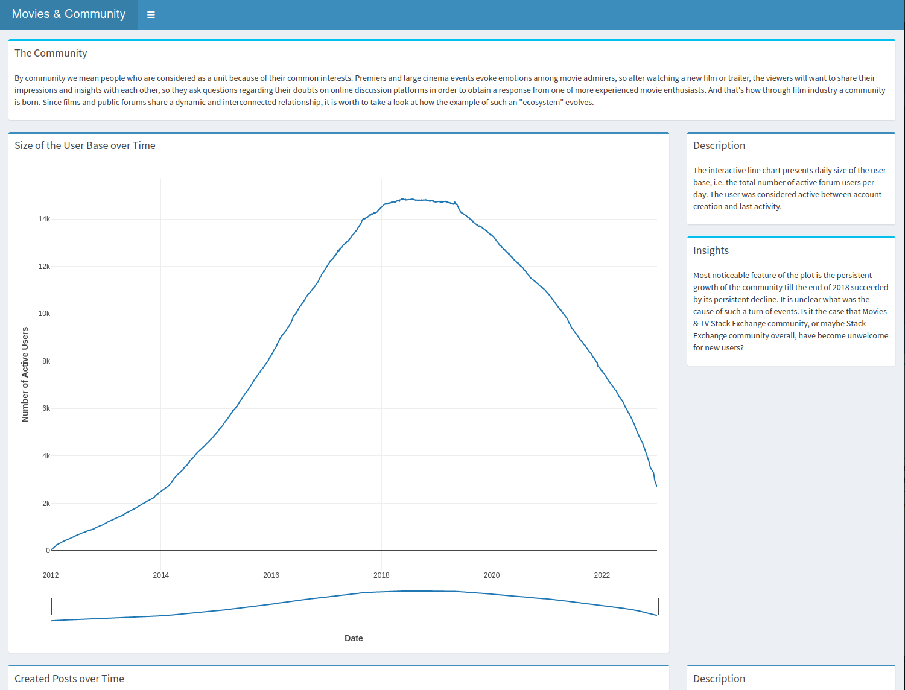

# Movies & Community

## About

The following dashboard was prepared in order to present the interconnected relationship between film industry and the community of film enthusiasts. In particular, such a relationship manifests itself in online discussion platforms, i.e. public internet forums, such as Movies & TV Stack Exchange — the part of the Stack Exchange network of Q&A websites. On the example of this service we presented how the size of user base or questions-answers proportions evolved over time, and which tags sparked lots of conversations between users. Since the common interests in cinema brought this forum to life, the results of our analysis will also provide insights about current trends in the film industry. Feel free to explore our work and thank you for your support.

## Instructions

Application hosted under link: [https://cebulam.shinyapps.io/eda-2023L-project2/](https://cebulam.shinyapps.io/eda-2023L-project2/)

## Structure

The dashboard consists of 4 tabs:

- The Community
- Why Tags?
- About
- References

## Screenshots:

