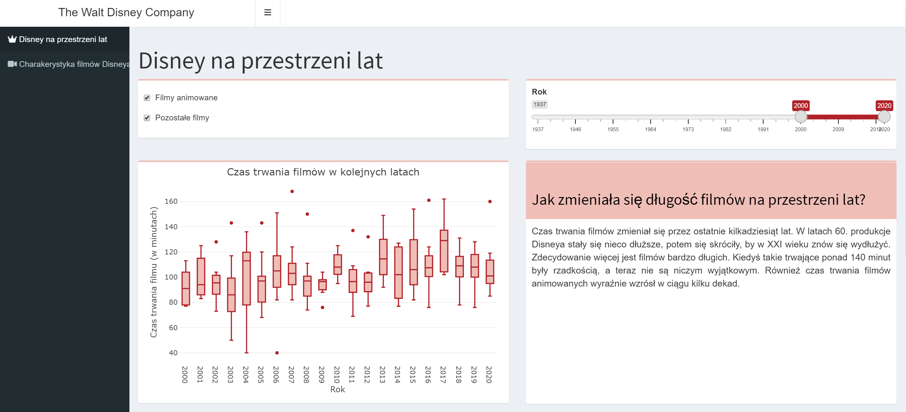
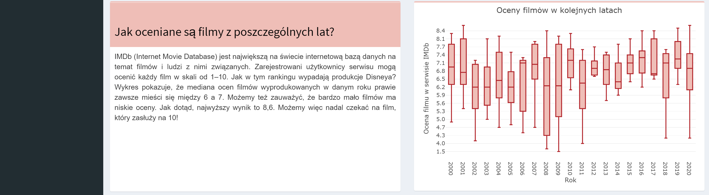
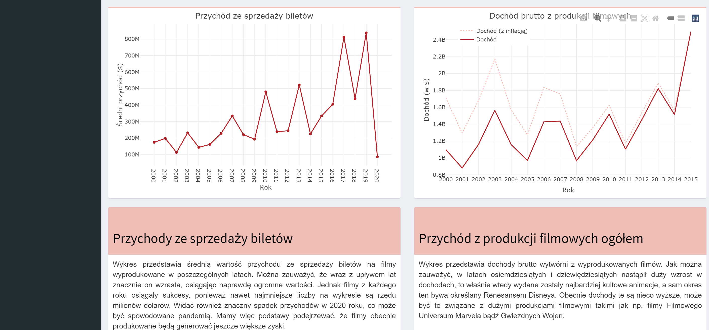
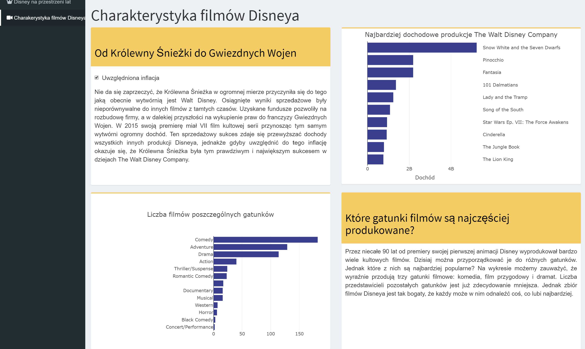

# The Walt Disney Company

## Wstęp

Przygotowana przez nas aplikacja przedstawia analizę The Walt Disney Company, wytwórni filmowej znanej z produkcji animacji i filmów wysokobudżetowych. Pochyliłyśmy się nad kwestiami takimi jak dochody firmy czy cechy stworzonych produkcji.

## Disney na przestrzeni lat

W tej części znajdują się wykresy przedstawiające rozkłady czasu trwania filmów oraz oceny z serwisu IMDb jak również wizualizacje przedstawiające dochody brutto i dochody ze sprzedaży biletów. Na szczycie strony znajduje się suwak pozwalający na wybór interesującego użytkownika przedziału czasowego oraz przyciski, dzięki którym można manipulować wyświetlanymi na wykresach danymi. Użytkownik może zadecydować czy dane mają dotyczyć wszystkich produkcji wytwórni, samych animacji, czy filmów nie będących animacjami. 

## Charakterystyka filmów Disneya

W drugiej części aplikacji znajdują się dwa wykresy słupkowe. Pod uwagę brane są filmy wyprodukowane między 1937 a 2016r.. Pierwszy z wykresów przedstawia dziesięć najbardziej dochodowych filmów firmy Disney.  Istnieje możliwość uwzględnienia inlflacji, do czego służy przycisk znajdujący się obok wykresu. Kolejna wizualizacja przedstawia najczęściej produkowane gatunki filmów przez wytwórnię. 

## Wygląd aplikacji

### Źródła:
[https://www.kaggle.com/datasets/prateekmaj21/disney-movies](https://www.kaggle.com/datasets/prateekmaj21/disney-movies), [https://www.kaggle.com/datasets/maricinnamon/walt-disney-character-dataset](https://www.kaggle.com/datasets/maricinnamon/walt-disney-character-dataset), [https://www.kaggle.com/datasets/maricinnamon/walt-disney-character-dataset](https://www.kaggle.com/datasets/maricinnamon/walt-disney-character-dataset)

### Autorki: 
Oliwia Trzcińska, Dorota Rzewnicka, Dominika Filimonow
