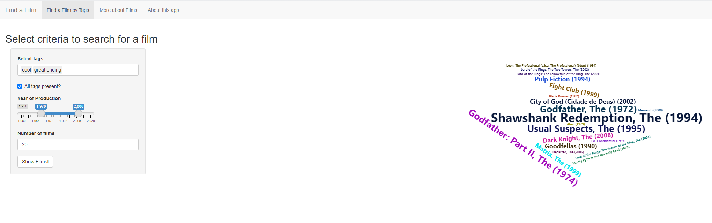
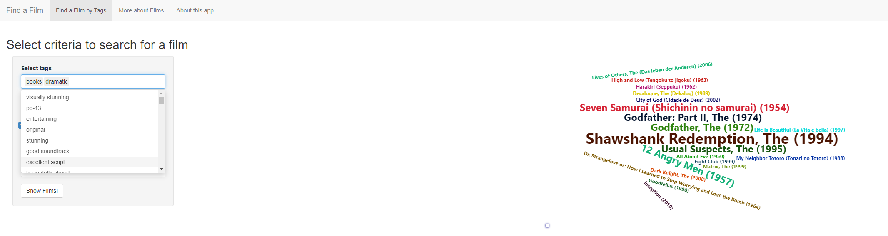
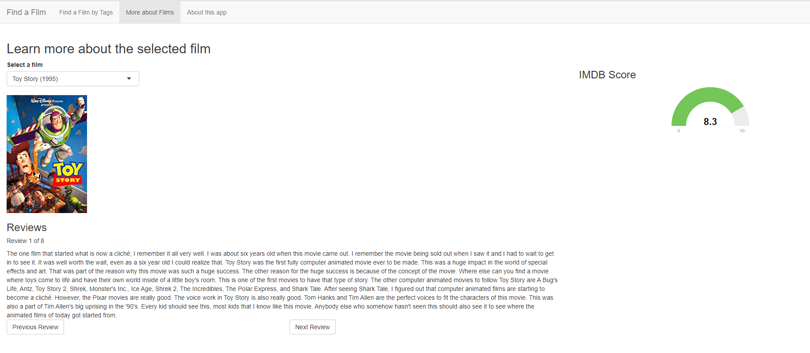
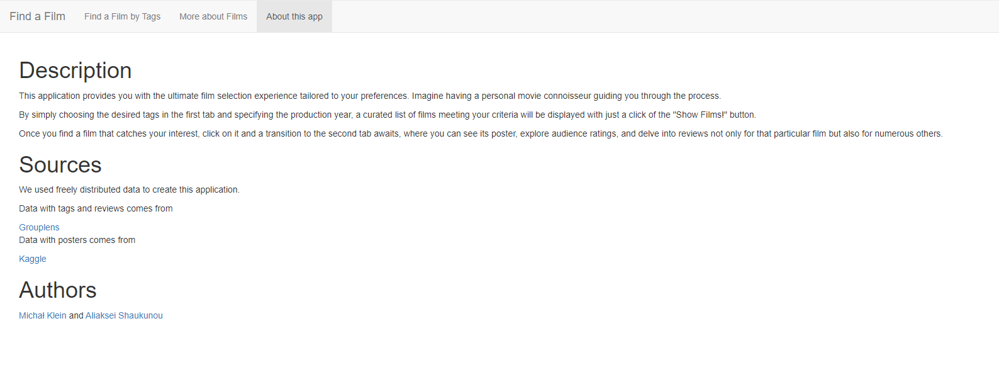

# Wstęp

Zastanawiając się nad tematem projektu, postanowiliśmy stworzyć coś korzystnego i interesującego. W związku z tym uświadomiliśmy sobie, że często wszyscy mamy problem zdecydować, jaki film obejrzeć.

Nasz projekt ma na celu rozwiązanie tego problemu.

# Co zrobiliśmy

Utworzyliśmy aplikację R Shiny, która wygląda następująco:

Na górze aplikacji jest menu nawigacyjne. Zacznijmy od pierwszej strony.

## Strona 1

Pierwsza strona jest główną częścią naszej aplikacji. Po prawej stronie znajduje się panel, na którym użytkownik może wprowadzić tagi (opis filmu jednym słowem) z dostępnych, przedział czasowy produkcji filmu, liczbę filmów do pokazania oraz checkbox 'All tags present'.
Jeżeli checkbox jest zaznaczony, to każdy z pokazanych filmów będzie odnosić się do wszystkich tagów. Jesli nie jest, to każdy z pokazanych filmów będzie odnosić się co najmniej do jednego z wybranych tagów.

Po naciśnięciu przycisku 'Show Films!' aplikacja tworzy wykres typu wordcloud z pasującymi filmami. Im większy rozmiar nazwy filmu, tym więszy jego ranking na IMDb.

Wybierając film, użytkownik może kliknąć na ten wykres i zostanie przekierowany do strony drugiej.

## Strona 2

Na drugiej stronie użytkownik zobaczy plakat filmu (o ile jest w bazie), jego ranking oraz recenzje widzów.
Jeżeli użytkownik trafił na drugą stronę w wyniku kliknięcia na wykres wordcloud, to zobaczy tu informacje dotyczące wybranego tytułu.

## Strona 3

Ta strona została przeznaczona do przedstawienia informacji o aplikacji, źródłach danych oraz autorach.

# Źródła danych

Dane zawierające tagi filmów zostały wzięty z [GroupLens](https://grouplens.org/datasets/movielens/).

Dane z posterami pochodzą z [Kaggle](https://www.kaggle.com/datasets/neha1703/movie-genre-from-its-poster).
