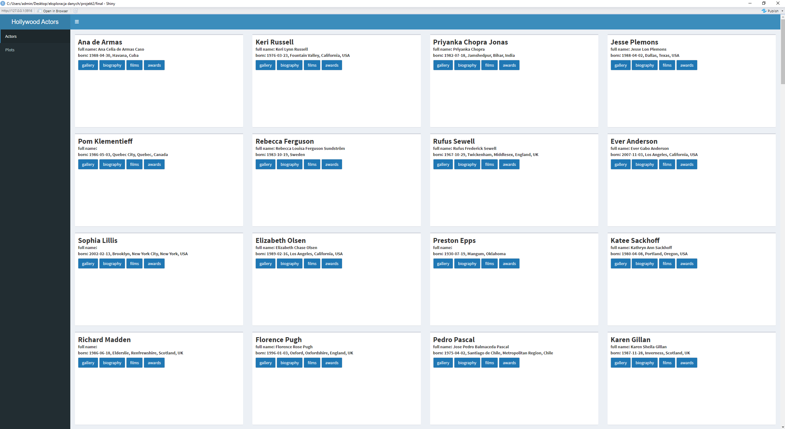
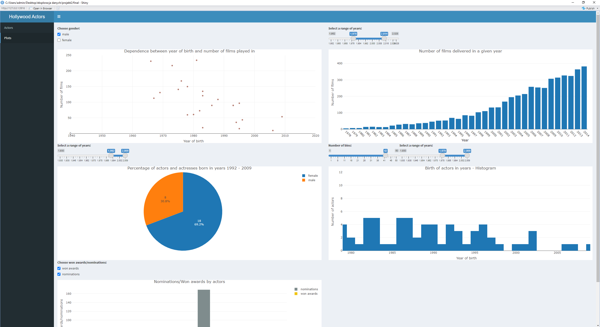

# Dane
Dane pozyskaliśmy z API serwisu IMDB. Dotyczą one około stu znanych aktorów, filmów, w których grali a także nagród, do których byli nominowani. Dane zawierają dodatkowo pokaźną liczbę zdjęć aktorów, które zostały wykorzystane w projekcie.
Dane zostały pobrane przy użyciu strony: [https://rapidapi.com/hub](https://rapidapi.com/hub)
# Zakładka "Actors"
W zakładce "Actors" znajdują się kafelki dotyczące poszczególnych aktorów i aktorek. W celu obejrzenia galerii związanej z danym aktorem należy nacisnąć przycisk „gallery”. W celu zapoznania się z biografią aktora należy nacisnąć przycisk „biography”. Mamy jeszcze możliwość przejrzenia filmografii aktora oraz listy nagród, do których był nominowany.

# Zakładka "Plots"
W zakładce "Plots", znajduje się 5 wykresów dotyczące wspomnianych wyżej danych w tym: wykresy punktowe, wykresy słupkowe/słupkowe grupowane, kołowe, histogramy.

