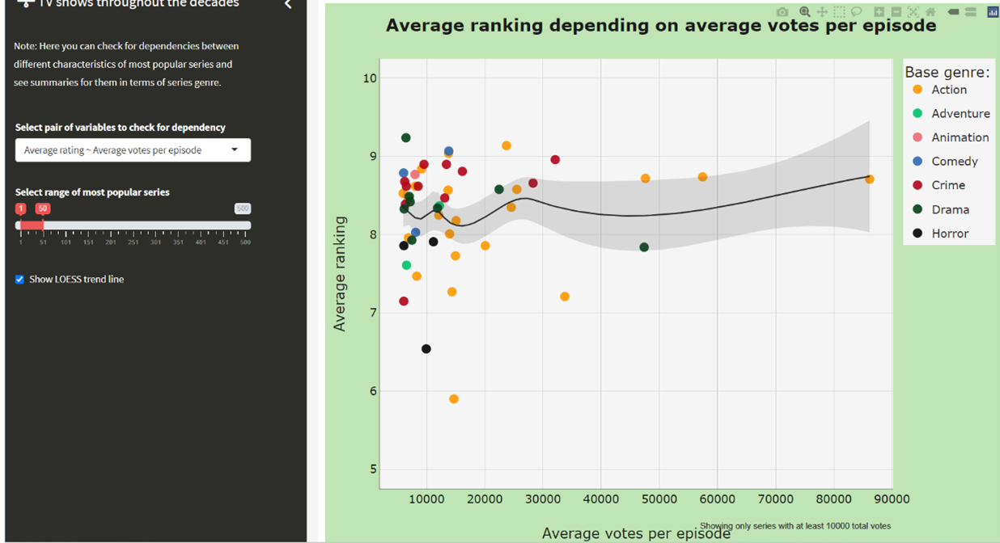
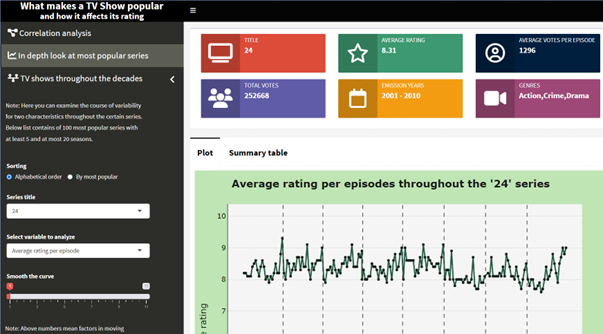
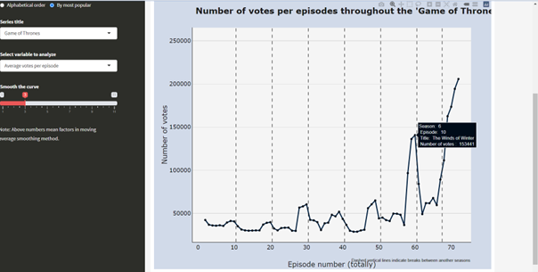
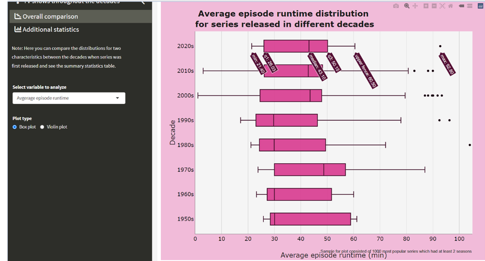
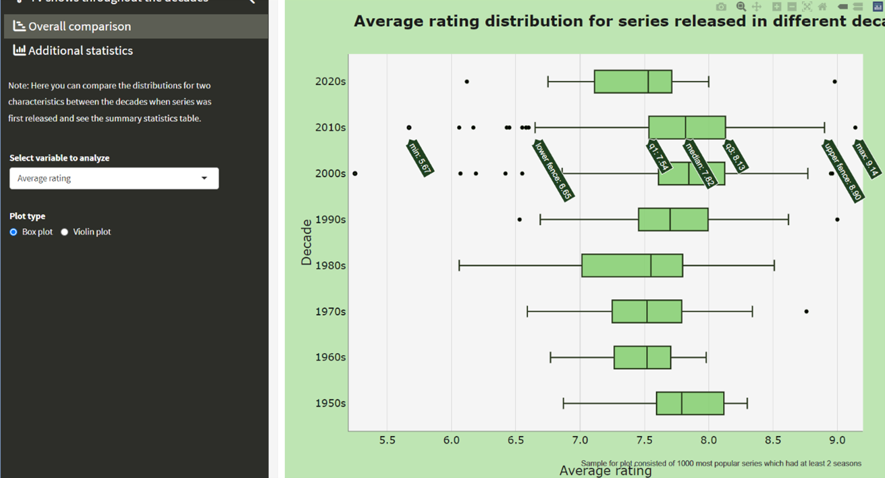
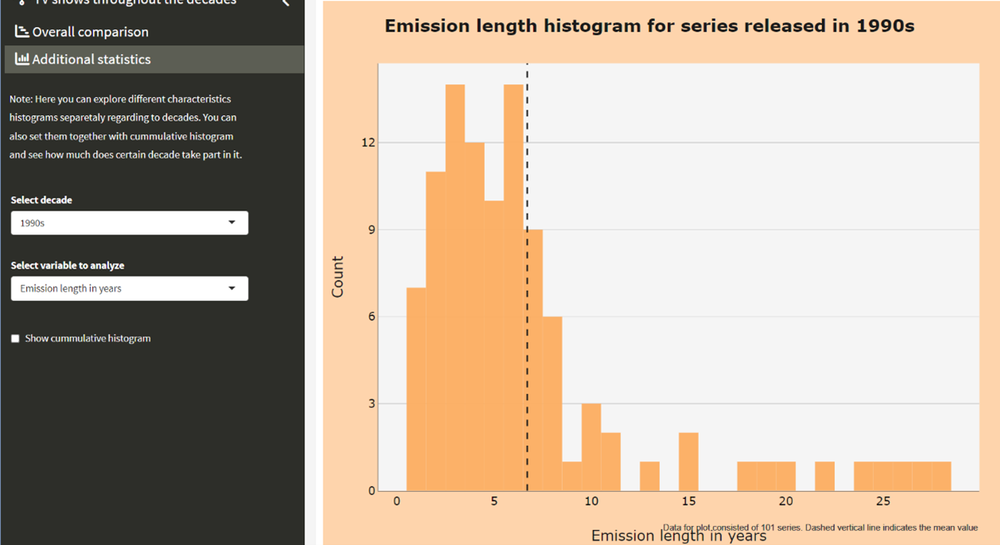
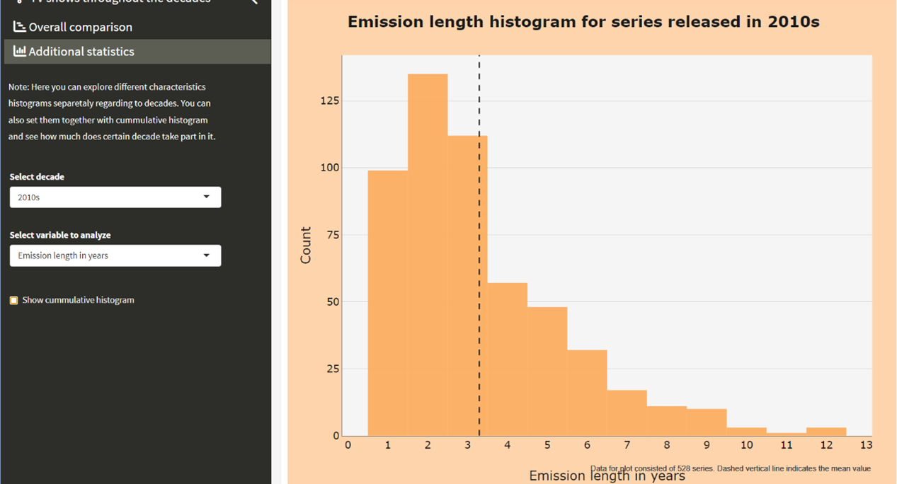
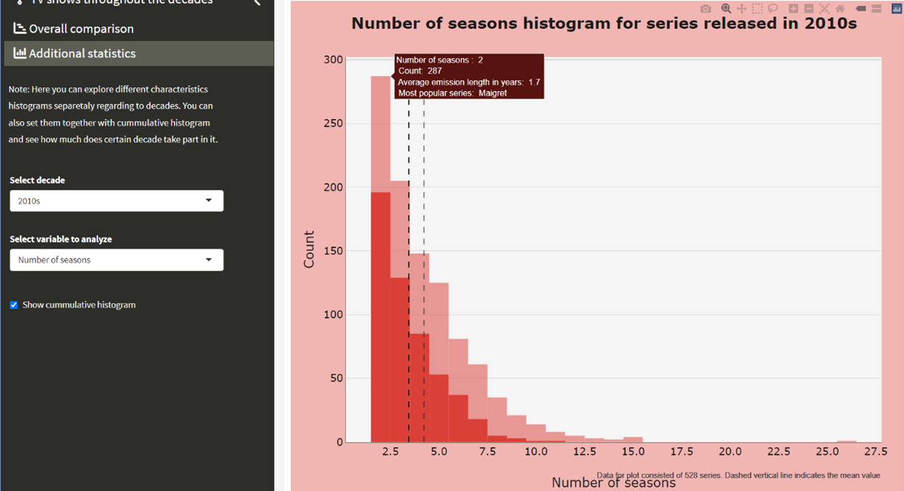

# Krótko o projekcie

Stworzony przez nas dashboard umożliwia wgląd do statystyk wielu popularnych seriali. Główną ideą naszego projektu było umożliwienie użytkownikowi przeprowadzenia własnej analizy najpopularniejszych seriali, tego co uczyniło je faktycznie najczęściej oglądanymi oraz czym się one charakteryzują. Mnogość nowożytnych seriali może się wydawać przytłaczająca... nasz dashboard umożliwia na prostą, przejrzystą i pokazową analizę tego zagadnienia!

## Zakładka „Correlation analysis"

W tej zakładce możemy przyjrzeć się bliżej korelacji kilku zmiennych na wykresie punktowym z podziałem na gatunki. Najeżdżając kursorem myszki na każdy kolorowy punkt ukazują się informacje związane z danym wykresem. Mamy 3 opcje zmiennych do wyboru: Average ranking depending on average votes per episode, Average votes per episode depending on average number of episodes per season oraz Average ranking depending on average number of episodes per season. Suwakiem poniżej możemy wybrać ile najpopularniejszych seriali chcemy brać pod uwagę, a przycisk poniżej dodaje/usuwa linię trendu z wykresu.

## Zakładka „In dept look at most popular series"

W tej zakładce przyglądamy się bliżej konkretnym serialom, które możemy wybrać z listy po lewej stronie. Możemy również ustawić czy wolimy sortować seriale alfabetycznie czy od najpopularniejszego. Po wybraniu serialu oraz jednej z dwóch zmiennych które możemy przeanalizować ukazuje się wykres liniowy. Możemy sobie nawet odpowiednio wygładzić jego linie. Na górze strony pokazują się podstawowe informacje o danym serialu m.in. tytuł, średni ranking serialu, data emisji serialu itd.

##Zakładka „TV shows through the decades -- overall comparison"

W tej zakładce za pomocą wykresu box plot/violin plot możemy przyjrzeć się rozkładowi jednej z dwóch zmiennych: średniemu rankingowi serialu oraz średniej długości odcinka serialu z podziałem na dekady. Przyglądając się tej pierwszej zależności możemy m.in. zaobserwować, że w każdej dekadzie mediana oceny to 7-7.5, co zgadza się z ogólnymi badaniami, które podają, że ludzie w sytuacji, gdzie mają coś ocenić w skali 1-10 najczęściej podają odpowiedź 7. Wybierając zależność długości odcinka możemy zaobserwować, że w latach 50-tych XX wieku mediana długości odcinka wynosiła około pół godziny, a w XXI wieku półtora razy dłużej czyli około 45 minut.

##Zakładka „TV shows through the decades -- Additional statistics"

W tej zakładce znajdziemy histogramy z podziałem na dekady dla trzech różnych zmiennych: średniego rankingu serialu, liczby sezonów oraz długość emisji serialu. Wybierając tę ostatnią zakładkę możemy zauważyć, że w latach 90tych (i podobnie w 80tych i latach 2000) średnia długość emisji wynosiła około 6 lat, a latach 2010-2020 wynosiła już 2 razy mniej -- około 3 lata. Z kolei obecnie maksymalnie 12 lat emitowane są seriale, a 20 lat temu długość emisji mogła wynosić aż 25 lat, co kojarzy nam się z tymi długimi tasiemcami telewizyjnymi, które potrafiły mieć po kilka tysięcy odcinków. Przerywaną linią zaznaczona jest średnia arytmetyczna danej zmiennej. Możemy również utworzyć skumulowany histogram dla wszystkich dekad, i na jego tle pojawi się histogram dekady, którą wybierzemy, co umożliwia nam porównanie rozkładu danej zmiennej w konkretnej dekadzie na przestrzeni ostatnich 70 lat.

