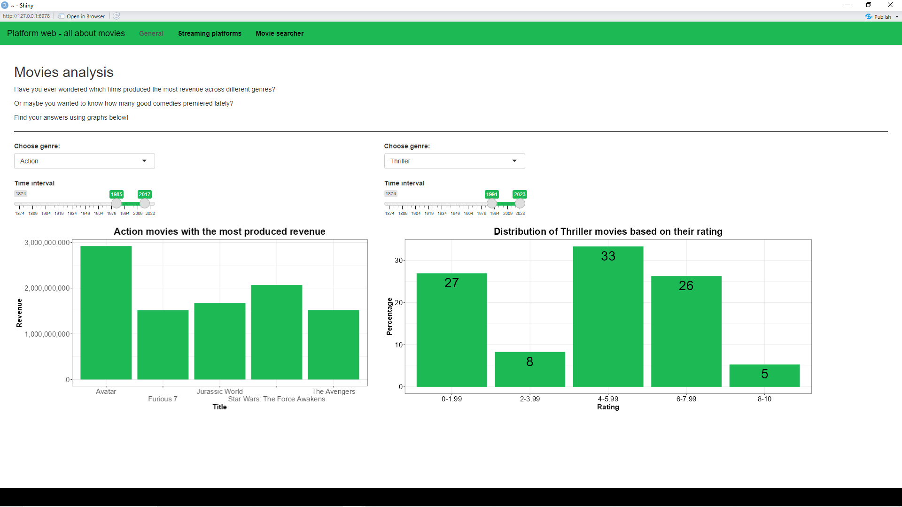
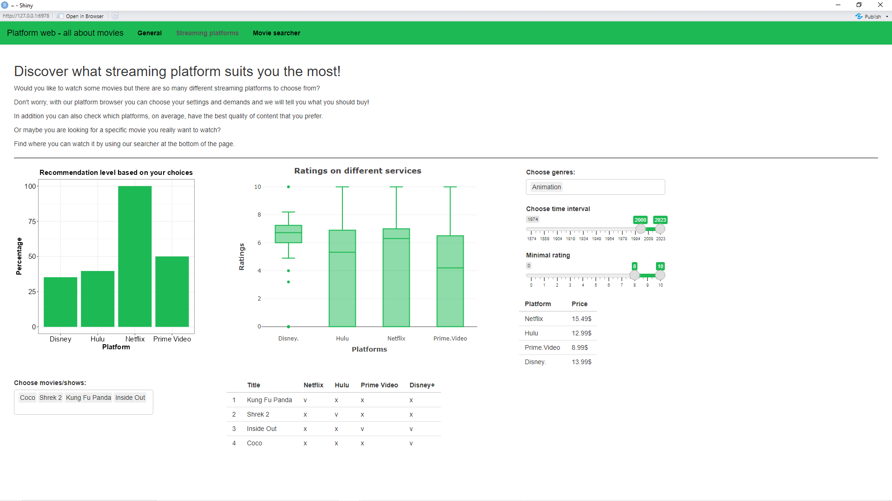

# Platform web - nasza aplikacja

## Wstęp

Przygotowaliśmy aplikację zawierającą interaktywne wykresy dotyczące
różnych danych na temat filmów. Oprócz tego użytkownik może znaleźć
najlepszą dla siebie platformę streamingową spośród następujących
Netflix, Hulu, Disney, Prime Video.

## General

Na pierwszej zakładce są dwa wykresy. Na pierwszym widoczne są filmy,
które wygenerowały największy przychód, można je filtrować ze względu na
rok premiery oraz gatunek. Następny wykres przedstawia procentowy
rozkład ocen filmów z danego gatunku i z możliwością wyboru przedziału
roku premiery.

## Streaming platforms

Ta zakładka służy do wybory platformy streamingowej. Zależnie od
wybranych gatunków, roku premiery, minimalnej oceny filmu oraz ilości
pieniędzy jakie użytkownik planuje wydać na platformę, wykres
przedstawia jak bardzo poszczególne platformy odpowiadają potrzebom
użytkownika. Drugi wykres korzysta z wybranych gatunków oraz roku
premiery i pokazuje rozkład ocen filmów spełniających zadane kryteria w
zależności od platformy. Ostatnią funkcjonalnością jest możliwość
sprawdzenia na jakich platformach znajduje się wybrany film.

## Movie searcher

Ostatnia zakładka służy do wyszukiwania filmów. Można ustawić takie
parametry jak datę premiery, przedział ocen, platformy do których mamy
dostęp i gatunek. Filmy można posortować zależnie od popularności lub
ocen.

## Źródła danych

-   <https://www.kaggle.com/datasets/ruchi798/movies-on-netflix-prime-video-hulu-and-disney?fbclid=IwAR1ocoEzUEXL9B6BKE5IQ302CpltPPvyV0UR4-gyD0nZlRxPuzhHiNDbHf0>
-   <https://www.kaggle.com/datasets/akshaypawar7/millions-of-movies?fbclid=IwAR3uS412nLlAsZLwQGGR9905hGuFkWJlZcdfCpio8CPf5SFRzDiab--t8ow>

## Screeny

